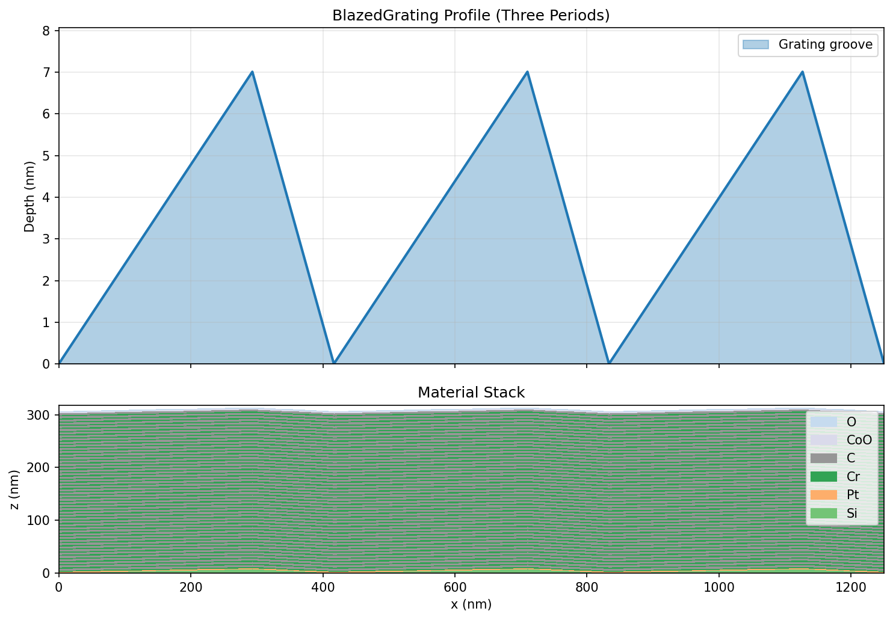
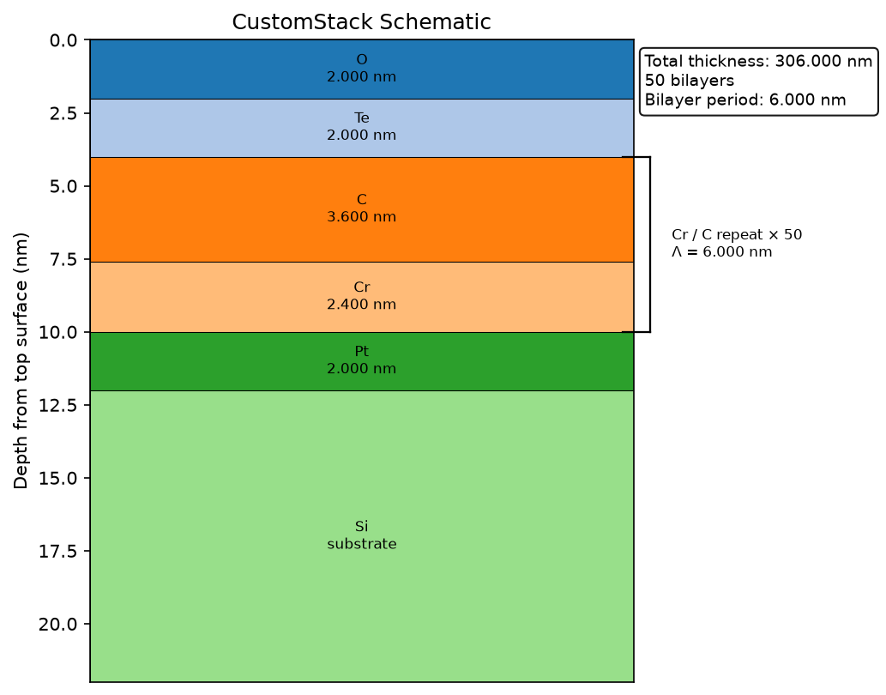

# Blazed Multilayer With Custom Stack

This example composes a custom stack around an actual `MultilayerStack`
definition and explicitly includes:

- a `2 nm` Pt layer above the Si substrate,
- a Cr/C multilayer block from `grax.MultilayerStack`,
- a `2 nm` CoO layer above the multilayer,
- a `2 nm` O top cap.

```python
import grax
from xrt.backends.raycing import materials as xrt_materials

silicon = xrt_materials.Material("Si", rho=2.329, table="Henke", name="Si")
platinum = xrt_materials.Material("Pt", rho=21.45, table="Henke", name="Pt")
chromium = xrt_materials.Material("Cr", rho=7.19, table="Henke", name="Cr")
carbon = xrt_materials.Material("C", rho=2.2, table="Henke", name="C")
carbon_oxide = xrt_materials.Material(
    elements=("Co", "O"),
    quantities=(1, 1),
    rho=6.44,
    table="Henke",
    name="CoO",
)
oxygen = xrt_materials.Material("O", rho=1.14, table="Henke", name="O")

d_period_nm = 6.0
gamma = 0.4
n_bilayers = 50

multilayer_stack = grax.MultilayerStack(
    substrate_material=silicon,
    material_a=chromium,
    material_b=carbon,
    d_period_nm=d_period_nm,
    gamma=gamma,
    n_bilayers=n_bilayers,
    top_material=carbon,
)

layers_bottom_up = [grax.LayerSpec(material=platinum, thickness_nm=2.0)]
layers_bottom_up.extend(multilayer_stack.layer_specs_bottom_up())
layers_bottom_up.append(grax.LayerSpec(material=carbon_oxide, thickness_nm=2.0))

custom_stack = grax.assemble_custom_stack(
    substrate_material=silicon,
    layers_bottom_up=layers_bottom_up,
    top_cap_material=oxygen,
    top_cap_thickness_nm=2.0,
)

blazed_grating = grax.BlazedGrating(
    period_lpermm=2400,
    blaze_angle_deg=1.37,
    anti_blaze_angle_deg=3.25,
    coating_stack=custom_stack,
    x_resolution_nm=0.5,
    z_resolution_nm=0.5,
)

blazed_grating.plot_profile("blazed_multilayer_custom_stack.png")
custom_stack.plot_schematic("blazed_multilayer_custom_stack_schematic.png")
```




