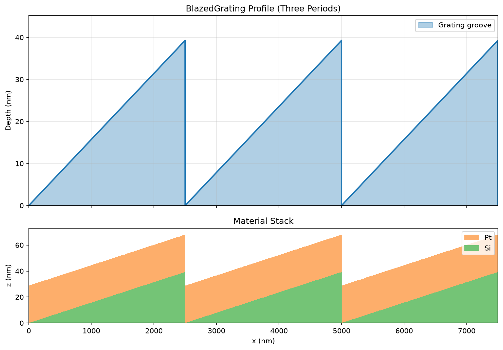
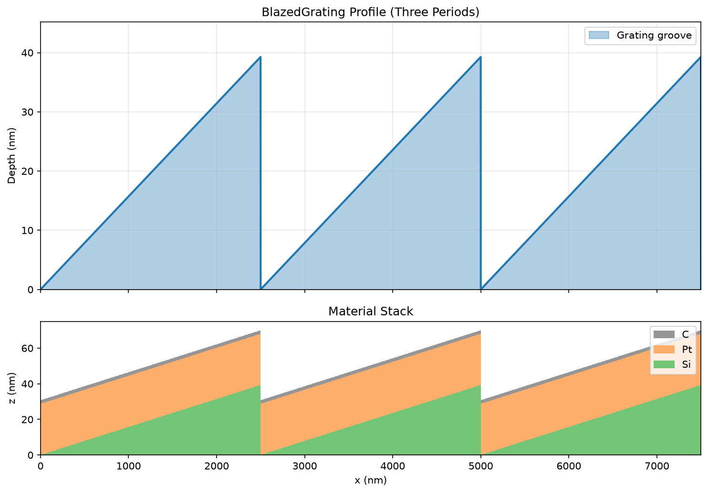

# Blazed Gratings

## Blazed grating without top layer

```python
import grax
from xrt.backends.raycing import materials as xrt_materials

silicon = xrt_materials.Material("Si", rho=2.329, table="Chantler total", name="Si")
platinum = xrt_materials.Material("Pt", rho=21.45, table="Chantler total", name="Pt")

blazed_grating = grax.BlazedGrating(
    period_lpermm=400,
    coating_stack=None,
    substrate_material=silicon,
    layer_material=platinum,
    layer_thickness_nm=28.77,
    top_cap_material=None,
    top_cap_thickness_nm=0.0,
    z_resolution_nm=0.1,
    x_resolution_nm=1.0,
    blaze_angle_deg=0.9,
    anti_blaze_angle_deg=None,
)

blazed_grating.plot_profile("blazed_no_top_cap.png")
```



## Blazed grating with top layer

```python
import grax
from xrt.backends.raycing import materials as xrt_materials

silicon = xrt_materials.Material("Si", rho=2.329, table="Chantler total", name="Si")
platinum = xrt_materials.Material("Pt", rho=21.45, table="Chantler total", name="Pt")
carbon = xrt_materials.Material("C", rho=2.2, table="Chantler total", name="C")

blazed_grating = grax.BlazedGrating(
    period_lpermm=400,
    coating_stack=None,
    substrate_material=silicon,
    layer_material=platinum,
    layer_thickness_nm=28.77,
    top_cap_material=carbon,
    top_cap_thickness_nm=2.0,
    z_resolution_nm=0.1,
    x_resolution_nm=1.0,
    blaze_angle_deg=0.9,
    anti_blaze_angle_deg=None,
)

blazed_grating.plot_profile("blazed_with_top_cap.png")
```



`BlazedGrating` computes `depth_nm` from `blaze_angle_deg` (and
`anti_blaze_angle_deg` when provided) during initialization, so the final depth
is geometry-driven. `width_to_period_ratio` and `depth_nm` are laminar-only
parameters and are not part of `BaseGrating` or `BlazedGrating`.
