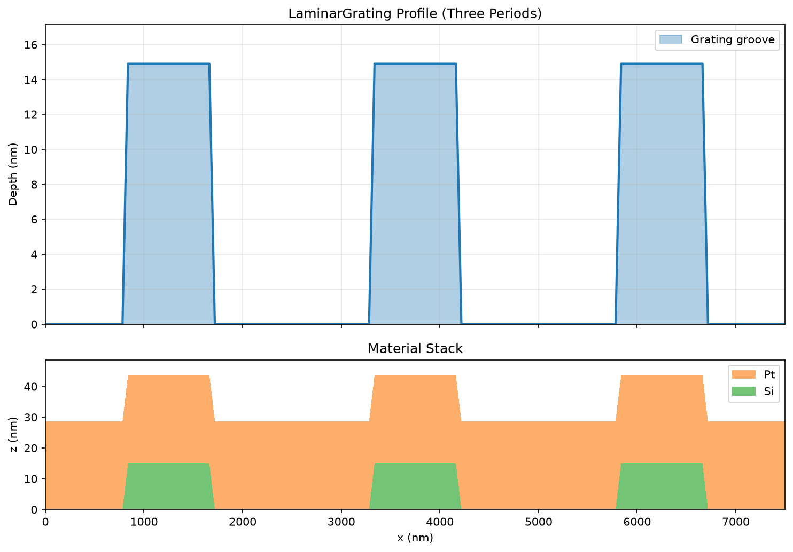
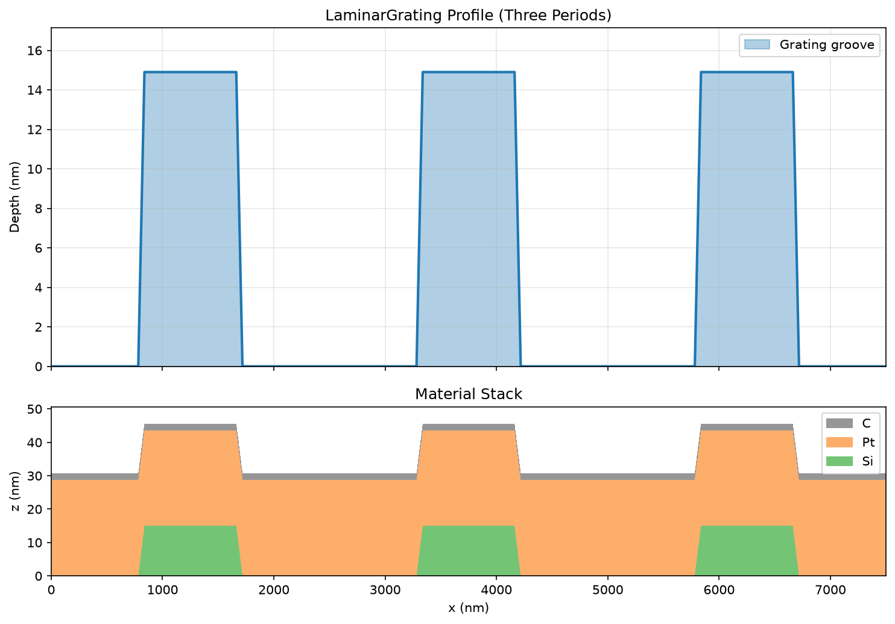

# Laminar Gratings

## Laminar grating without top layer

```python
import grax
from xrt.backends.raycing import materials as xrt_materials

silicon = xrt_materials.Material("Si", rho=2.329, table="Chantler total", name="Si")
platinum = xrt_materials.Material("Pt", rho=21.45, table="Chantler total", name="Pt")

laminar_grating = grax.LaminarGrating(
    period_lpermm=400,
    width_to_period_ratio=0.67,
    depth_nm=14.9,
    coating_stack=None,
    substrate_material=silicon,
    layer_material=platinum,
    layer_thickness_nm=28.77,
    top_cap_material=None,
    top_cap_thickness_nm=0.0,
    z_resolution_nm=0.1,
    x_resolution_nm=1.0,
    left_wall_angle_deg=15.0,
    right_wall_angle_deg=15.0,
)

laminar_grating.plot_profile("laminar_no_top_cap.png")
```



## Laminar grating with top layer

```python
import grax
from xrt.backends.raycing import materials as xrt_materials

silicon = xrt_materials.Material("Si", rho=2.329, table="Henke", name="Si")
platinum = xrt_materials.Material("Pt", rho=21.45, table="Henke", name="Pt")
carbon = xrt_materials.Material("C", rho=2.2, table="Henke", name="C")

laminar_grating = grax.LaminarGrating(
    period_lpermm=400,
    width_to_period_ratio=0.67,
    depth_nm=14.9,
    coating_stack=None,
    substrate_material=silicon,
    layer_material=platinum,
    layer_thickness_nm=28.77,
    top_cap_material=carbon,
    top_cap_thickness_nm=2.0,
    z_resolution_nm=0.1,
    x_resolution_nm=1.0,
    left_wall_angle_deg=15.0,
    right_wall_angle_deg=15.0,
)

laminar_grating.plot_profile("laminar_with_top_cap.png")
```


